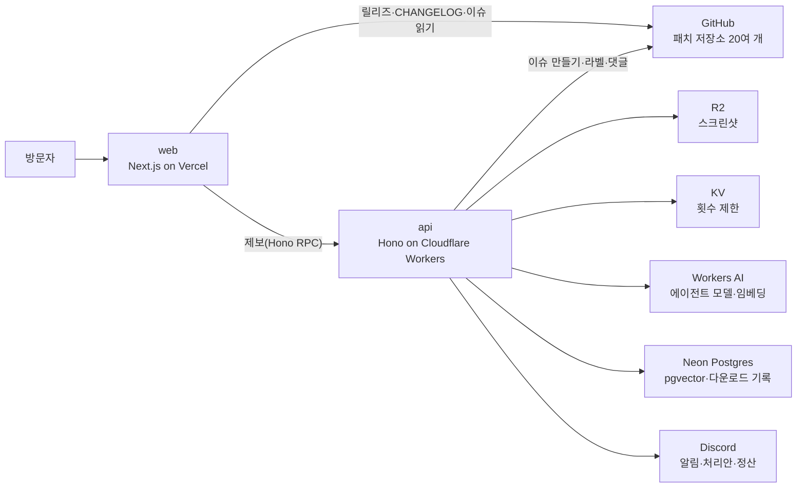

# arqhive

**arqhive(아카이브)** — 한글 패치 아카이브. 직접 만든 게임 한글 패치를 게임 케이스 진열장처럼 소개하고, 받고, 제보할 수 있는 사이트입니다.

- 사이트: https://arqhive.vercel.app
- 앱 흐름(그림): [app-flow.md](app-flow.md)
- 설계 결정 기록(ADR): [docs/adr](docs/adr/README.md)
- 처음 기획과 달라진 점: [docs/project-plan.md](docs/project-plan.md)
- 만들면서 나온 실수와 교훈: [docs/mistake-log.md](docs/mistake-log.md)

## 소개

닌텐도 게임 20여 편(GC·Wii·Wii U·3DS·NDS·DSiWare·SFC·GB·GBA)의 한글 패치를 한곳에 모았습니다. 패치마다 GitHub 저장소가 따로 있고, 이 사이트는 그 저장소들을 읽어 보여 주는 진열장이자 제보 창구입니다. 운영비는 0원입니다(모두 무료 플랜).

### 주요 기능

- **진열장과 케이스 열기**: 기종별 선반에 등줄기가 꽂혀 있고, 누르면 실물처럼 그린 케이스(킵 케이스·종이상자)가 그 자리에서 꺼내져 열립니다. 표지·디스크·카트리지는 모두 CSS로 그렸습니다.
- **매체를 누르면 바로 다운로드**: 릴리즈 파일 이름 규칙(`[게임 코드]_KPatch_[버전]`)으로 최신 릴리즈에서 받을 파일을 고릅니다. 받는 방식이 두 벌인 3DS 패치는 버튼 두 개로 나눕니다.
- **릴리즈만 올리면 따라오는 정보**: 버전·날짜·받을 파일·다운로드 수·업데이트 내역(CHANGELOG)을 GitHub에서 읽습니다(10분 주기).
- **속지**: 원본 판·적용 방식·구동 확인·번역 범위·알려진 문제, 롬 패치는 원본·패치 후 해시 표.
- **가이드**: 패치 방식별 적용 방법과 자주 묻는 질문.
- **제보**: 로그인 없이 글과 스크린샷으로 제보하면 그 패치 저장소에 GitHub 이슈로 올라갑니다(봇 확인·횟수 제한·저장 용량 예산).
- **제보 처리 AI 에이전트**: 새 제보를 읽고 분류·중복·알려진 문제·첫 답변 초안을 만들어 운영자에게 보냅니다. 운영자가 서명 링크로 승인해야 GitHub에 반영됩니다(아래 참고).
- **운영**: 매일 밤 디스코드로 일일 정산(방문·다운로드·에이전트 지표), 바깥 감시·정기 작업 감시·오류 알림, main에 푸시하면 자동 배포.

### 제보 처리 에이전트

프레임워크 없이 도구 호출 루프를 직접 짰습니다.

- **루프**: 모델(Workers AI, Llama 3.3 70B)이 도구를 고르면 코드가 실행해 결과를 붙여 다시 부릅니다(최대 6턴).
- **도구(읽기만)**: 패치 정보, 비슷한 지난 제보·가이드 문단 검색(Neon pgvector, bge-m3 임베딩).
- **출력 검증**: 모델이 낸 처리안을 그대로 믿지 않습니다. 도구 결과에 없는 근거는 지우고, 기준에 못 미치면(말투·최신 버전 누락 등) 이유를 붙여 다시 쓰게 합니다.
- **프롬프트 인젝션 대비**: 제보 본문은 데이터로만 다룹니다.
- **사람 승인**: HMAC 서명 링크 → 검토 화면에서 답변을 고쳐 적용하거나 무시합니다. 한 번만 반영되고, AI 초안임을 댓글에 밝힙니다.
- **평가(eval)**: 가상 제보 30개로 분류·중복·인젝션 저항 등을 채점해 지시문을 v1 → v3로 다듬었습니다(`apps/api/eval`).
- **비용 관리**: 무료 한도(하루 1만 뉴런)에 맞춰 하루 20회 제한, 끄는 스위치, 승인율·수정률 지표.

## 구조



자세한 흐름(페이지가 만들어지는 길, 제보, 에이전트, 정산, 배포)은 [app-flow.md](app-flow.md)에 있습니다.

## 기술 스택

| 영역 | 사용 | 쓰는 곳 |
|---|---|---|
| 언어·모노레포 | TypeScript 6(strict), pnpm workspace, Turborepo | 전체 |
| 웹 | Next.js 16(App Router, RSC·ISR·Server Function), React 19, Tailwind CSS 4 | `apps/web` |
| 웹 구조 | Feature-Sliced Design(Steiger로 검사) | `apps/web/src` |
| 데이터 가져오기 | TanStack Query, Hono RPC(API 타입 공유) | 업데이트 내역·제보 |
| 콘텐츠 | MDX + Velite(Zod 스키마) | `content/`, `packages/content` |
| API | Hono on Cloudflare Workers(Cron·KV·R2·Workers AI) | `apps/api` |
| DB | Neon Postgres + Drizzle ORM, pgvector | `packages/db` |
| AI | Workers AI(Llama 3.3 70B 함수 호출, bge-m3 임베딩) | 제보 처리 에이전트 |
| 검증·보안 | Zod, Cloudflare Turnstile, HMAC 서명 링크, CSP·보안 헤더 | 제보·승인 |
| 통계·알림 | Umami(쿠키 없음), Discord 웹훅 | 방문 통계·운영 알림 |
| 감시 | UptimeRobot, healthchecks.io, Next.js `onRequestError` | 모니터링 |
| 품질 | Biome(엄격 규칙), Vitest, Playwright(Chromium·WebKit), lefthook, GitHub Actions | 커밋·CI |
| 배포 | Vercel(web), GitHub Actions → `wrangler deploy`(api) | main 푸시 |

### 지키는 것

- **운영비 0원**: 모든 서비스를 무료 플랜 안에서 씁니다. 기능을 고를 때 무료 플랜에서 되는지부터 확인합니다.
- **엄격한 검사**: Biome 엄격 규칙·FSD 규칙·타입·테스트·빌드를 커밋(lefthook)과 CI에서 같은 순서로 돌리고, 화면은 Chromium과 WebKit(아이폰 Safari 엔진)으로 따로 검사합니다.
- **지원 브라우저**: 최신 데스크톱 브라우저와 iOS 17 이상 Safari.
- **비밀값은 저장소 밖에**: Cloudflare·Vercel·GitHub 비밀값으로만 넣습니다.

## 구성

| 경로 | 내용 |
|---|---|
| `apps/web` | Next.js(App Router) on Vercel, FSD 구조 |
| `apps/api` | Hono on Cloudflare Workers, 기능별 모듈 |
| `packages/shared` | web·api가 함께 쓰는 규칙·상수(Zod 스키마는 `*-schema.ts`) |
| `packages/content` | 패치·가이드 글(MDX)을 Velite 데이터로 |
| `packages/db` | Neon(Postgres) 스키마·마이그레이션(Drizzle) |
| `packages/tsconfig` | 환경별 TypeScript 설정 |

## 시작하기

준비물: Node 24, pnpm 10

```bash
pnpm install
pnpm build   # 처음 한 번: 콘텐츠 데이터(.velite/) 등 빌드 결과물을 만든다
pnpm dev
```

## 명령

| 명령 | 하는 일 |
|---|---|
| `pnpm dev` | web·api 개발 서버 |
| `pnpm build` | 전체 빌드 |
| `pnpm lint` / `pnpm lint:fix` | Biome 검사 / 고칠 수 있는 것 고치기 |
| `pnpm lint:fsd` | FSD 규칙 검사(Steiger) |
| `pnpm typecheck` | 타입 검사 |
| `pnpm test` | 단위 테스트 |
| `pnpm e2e` | 화면 검사(Playwright, Chromium·WebKit). 먼저 `pnpm build`, 처음 한 번 `pnpm --filter @arqhive/web exec playwright install chromium webkit` |
| `pnpm check` | CI와 같은 검사 전체 |
| `pnpm ops` | 운영 상태 한눈에(사이트·CI·배포·감시·DB) |
| `pnpm --dir apps/api agent:eval` | 에이전트 평가(개발 서버 필요, 실제 모델 호출) |
