# 앱 흐름

arqhive가 **어떤 순서로 움직이는지** 정리한 문서입니다. 기능을 바꿔 흐름이 달라지면 함께 고칩니다.
설계 이유(왜 이렇게 정했는지)는 각 절에 적은 ADR 번호를 따라 [`docs/adr/`](docs/adr/README.md)에서 볼 수 있습니다.

목차
1. [전체 그림](#1-전체-그림)
2. [저장소 구성](#2-저장소-구성)
3. [페이지가 만들어지는 길](#3-페이지가-만들어지는-길)
4. [진열장과 케이스 열기](#4-진열장과-케이스-열기)
5. [제보 보내기](#5-제보-보내기)
6. [운영자 알림과 일일 정산](#6-운영자-알림과-일일-정산)
7. [방문 통계](#7-방문-통계)
8. [타입이 흐르는 길](#8-타입이-흐르는-길)
9. [콘텐츠가 데이터가 되는 길](#9-콘텐츠가-데이터가-되는-길)
10. [디자인 토큰과 글꼴](#10-디자인-토큰과-글꼴)
11. [검사·배포](#11-검사배포)
12. [보안](#12-보안)
13. [모니터링과 장애 대응](#13-모니터링과-장애-대응)
14. [제보 처리 에이전트](#14-제보-처리-에이전트)

## 1. 전체 그림

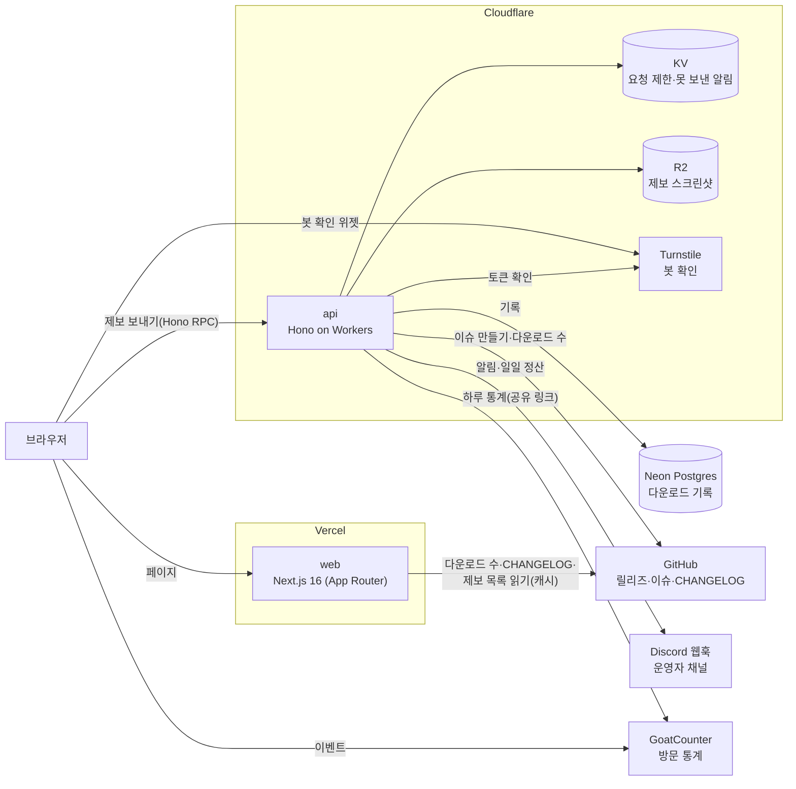

- **web**은 거의 모든 페이지를 미리 만들어 두고(정적·ISR), 바깥 데이터(GitHub)는 서버에서 읽어 캐시합니다. 브라우저에서 바로 부르는 곳은 제보 API와 업데이트 내역(서버 함수)뿐입니다.
- **api**는 사용자 입력을 받는 일(제보)과 정해진 시각에 도는 일(Cron)을 맡습니다. 비밀값(GitHub 토큰, 웹훅, DB 주소)은 모두 여기 있습니다.
- 운영비는 0원입니다(모두 무료 플랜, ADR 0002).

## 2. 저장소 구성

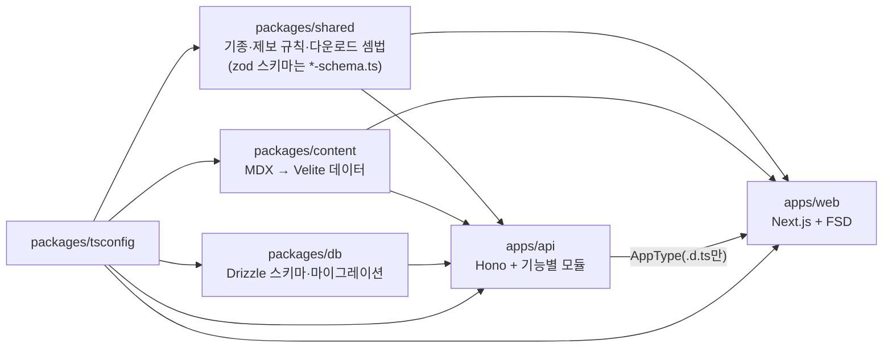

| 경로 | 맡는 일 |
|---|---|
| `apps/web` | 사이트. `src/`는 FSD 층(app → pages → widgets → entities → shared, 위에서 아래로만 import) |
| `apps/api` | API. `src/modules/<기능>`(health·reports·notifications·daily-report), 바깥 연결은 `src/platform` |
| `packages/shared` | web·api가 함께 쓰는 규칙. 빌드 없는 내부 패키지(TS 원본을 그대로 씀), `sideEffects: false` |
| `packages/content` | `content/`의 MDX를 Velite로 읽어 타입이 붙은 데이터로 |
| `packages/db` | Neon(Postgres) 표 정의와 SQL 마이그레이션(`drizzle/`) |
| `content/` | 패치·가이드·FAQ 글(MDX·MD). 패치 하나 = 폴더 하나 |

## 3. 페이지가 만들어지는 길

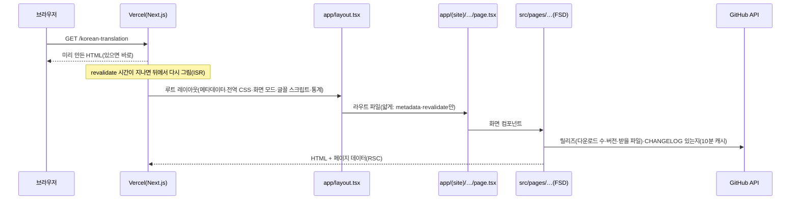

| 주소 | 화면(`src/pages`) | 다시 그리는 주기 |
|---|---|---|
| `/` | `home` 사이트 소개 | 빌드 때 한 번 |
| `/korean-translation` | `korean-translation` 진열장 | 10분(버전·다운로드 수·최근 갱신) |
| `/korean-translation/<slug>` | 같은 진열장 + 소개 띠, 그 패치 케이스를 바로 엶 | 10분 |
| `/guide` | `guide` 버전 가이드·FAQ | 빌드 때 |
| `/report` | `report` 제보 양식 + 들어온 제보 | 5분(제보 목록) |
| `/sitemap.xml`, `/robots.txt` | `app/sitemap.ts`, `app/robots.ts` | 빌드 때(콘텐츠에서 생성) |

- 라우트 파일(`app/(site)/…/page.tsx`)은 FSD의 화면을 다시 내보내고, Next.js만 읽는 설정(`metadata`, `revalidate`, `generateStaticParams`)만 둡니다.
- **검색 노출**: 페이지마다 description·canonical·OG(`shared/lib/page-metadata.ts`), 패치 주소는 진열장 위 소개 띠(h1·소개)를 서버에서 그립니다. 등줄기·표지·목록 줄은 진짜 링크(`<a href>`)라 검색엔진이 패치 주소를 찾습니다.
- 서버 컴포넌트가 클라이언트 컴포넌트에 넘긴 값은 HTML 안의 페이지 데이터로 실립니다. 그래서 바로 안 보이는 큰 데이터(CHANGELOG 본문)는 넘기지 않고 누를 때 받습니다(4절).

## 4. 진열장과 케이스 열기

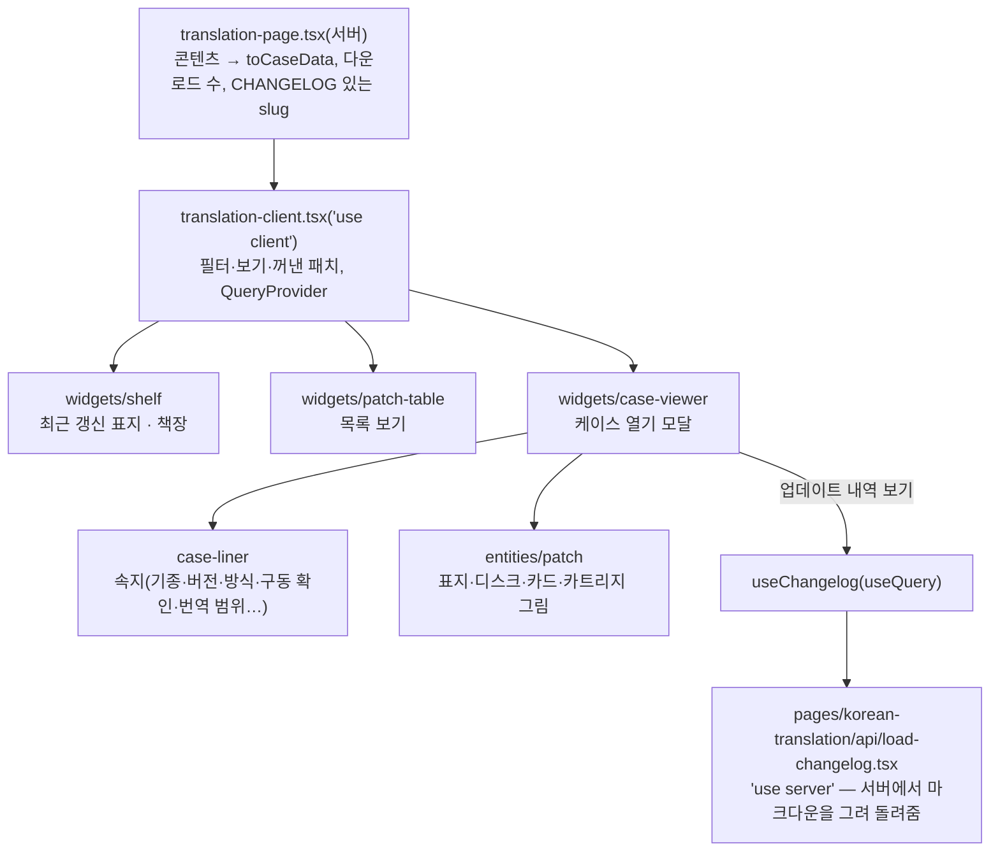

열고 닫는 순서

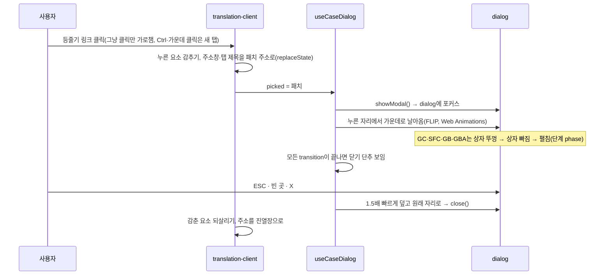

- 패치 주소로 바로 들어오면 선반이 자리 잡은 뒤(글꼴·두 번 그린 뒤) 그 등줄기를 누른 것처럼 엽니다(`use-open-from-address.ts`).
  - 위에는 서버가 그린 소개 띠(제목 h1·요약, 검색엔진용)가 보입니다. 케이스를 닫으면 주소만 진열장으로 바뀌고 페이지는 다시 그리지 않으므로, 클라이언트가 소개 띠를 치웁니다(서버 페이지가 `intro` 칸으로 넘김).
- **매체 → 직접 다운로드**: 릴리즈 첨부 파일 이름 규칙 `[게임 코드]_KPatch_[버전][_꼬리].[확장자]`(게임 코드는 콘텐츠의 `downloadCode`)로 서버가 최신 릴리즈에서 파일을 고릅니다(`@arqhive/shared`의 `pickDownloads`, 다운로드 수와 같은 요청·10분 캐시).
  - 같은 최신 릴리즈의 태그·공개 날짜(한국 날짜)를 버전·날짜 표시에 씁니다(`releaseStamp`). 패치 저장소에 릴리즈만 올려도 케이스·목록·소개 띠의 버전이 따라오고, 콘텐츠의 `latestVersion`·`latestReleaseDate`는 GitHub를 못 읽을 때의 예비값입니다. 에이전트의 `getPatch`도 같은 값을 씁니다.
  - 대표 파일(꼬리 없음, 여럿이면 zip)이 있으면 매체를 누르는 즉시 받습니다.
  - 받는 방식이 두 벌인 패치(`_CIA`·`_LayeredFS`, 3DS)는 매체 대신 케이스 아래 버튼 두 개로 나눕니다.
  - 릴리즈에 못 올린 큰 선택 파일(환영이문록 동영상 자막 패치, 구글 드라이브)은 콘텐츠의 `extraDownloads`로 매체 아래 버튼을 하나 더 놓고 새 탭으로 엽니다.
  - 파일을 못 고르면 예전처럼 `releases/latest`를 새 탭으로 엽니다. 속지의 "릴리즈 노트 ↗"는 언제나 릴리즈 페이지로 갑니다.
- **파일 확인값**: 롬 패치(BPS·IPS)는 속지 정보 목록 아래에 원본·패치 후 크기와 해시 표가 보입니다(콘텐츠의 `fileCheck`, 각 저장소 README 표를 옮긴 값). 결과 값의 기준 버전이 최신 릴리즈와 다르면 그렇다고 알립니다.
- **업데이트 내역**: 모달을 열 때 `useQuery(['changelog', slug])`가 서버 함수를 부릅니다. 한 번 받은 패치는 캐시에서 바로 나오고, 받는 동안은 높이가 고정된 창에 스켈레톤이 보입니다.
- "동작 줄이기" 설정이면 연출 없이 바로 열고 닫습니다.

## 5. 제보 보내기

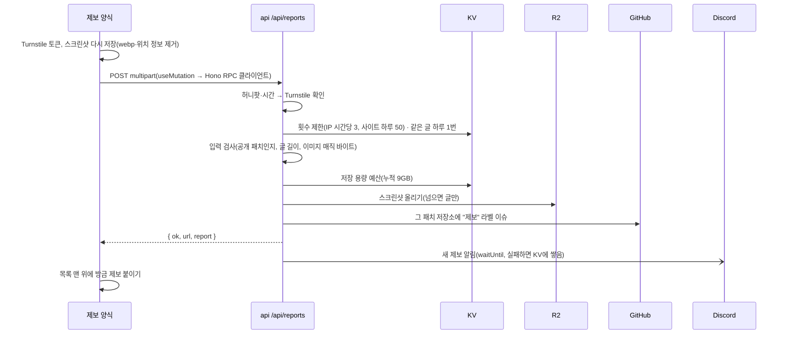

- 실패하면 코드(invalid·rate·bot·server)로 알맞은 안내를 고릅니다. 응답이 아예 없으면 network.
- **들어온 제보 목록**은 web 서버가 GitHub 검색(`user:arqhive label:"제보"`)으로 읽어 5분 캐시합니다. 방금 보낸 제보는 API 응답으로 바로 붙이고, 나중에 서버 목록에 들어오면 id로 걸러 두 번 보이지 않습니다.
- 개발 중(`REPORT_DRY_RUN=1`)에는 이슈를 만들지 않고, 알림에 `[시험]`이 붙습니다.
- 개발용 스크린샷 주소(`/api/reports/images/…`)는 이미지 주소 설정이 API 자신을 가리킬 때만 열립니다(배포는 R2 공개 주소).

## 6. 운영자 알림과 일일 정산

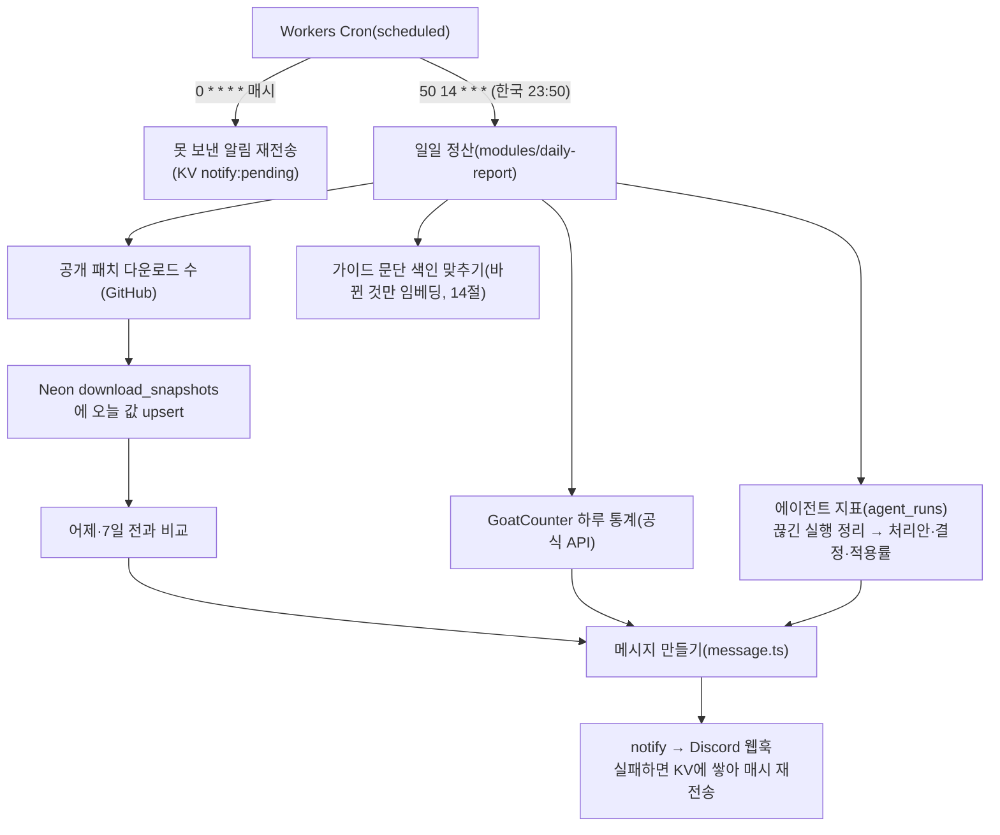

- 알림은 디스코드 웹훅 하나입니다(ADR 0014). 사용자 글의 멘션은 울리지 않게 막습니다.
- 다운로드 기록은 날짜별로 남습니다(ADR 0016). 셈법은 사이트 화면과 같습니다(`@arqhive/shared`의 `sumLargestDownloads`: 릴리즈마다 가장 많이 받은 파일 하나).
- 방문 통계는 GoatCounter 공식 API(통계 읽기 권한만 있는 키)로 읽습니다(ADR 0019). 이벤트 경로(`case-open/패치` 등)를 패치별·구간별로 묶어 셉니다. 실패하면 그 부분만 "읽지 못함"이 되고 나머지는 보냅니다.
- 에이전트 지표(14절): 오늘 만든 처리안(보류·한도·평균 시간·뉴런 어림), 오늘 결정(적용·고쳐서 적용·무시), 누적 적용률·수정률·승인 대기. 시험 제보는 빼고, 10분 넘게 running으로 남은 실행은 "시간 초과로 끊김"으로 정리합니다.

## 7. 방문 통계

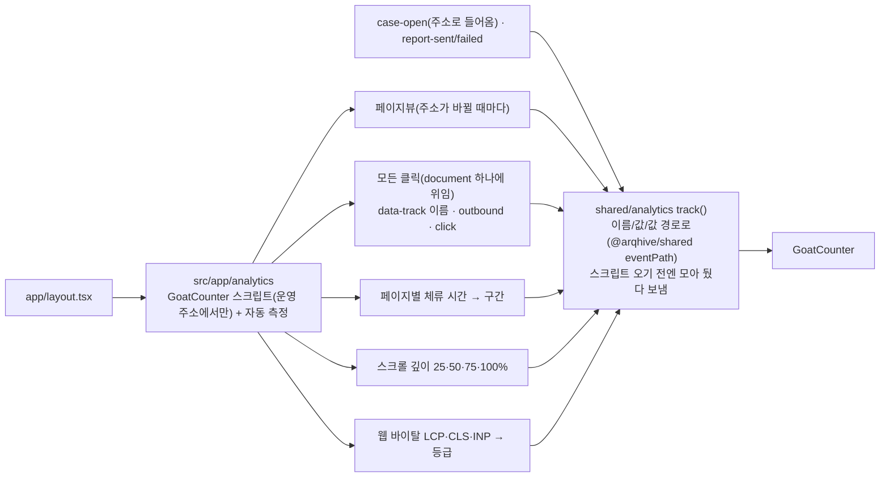

- 쿠키를 쓰지 않아 동의 배너가 없습니다(ADR 0019). 사용자가 입력한 글은 보내지 않습니다.
- GoatCounter 이벤트는 값을 따로 못 담아 이름 뒤에 잇습니다: `case-open/star-fox-2`, `download/패치/파일`, `page-time/1-3m/guide`, `scroll-depth/50/guide`, `web-vitals/LCP/good`, `click/누른 것`, `outbound/바깥 주소`.
- 숫자는 모두 "방문"(같은 사람이 8시간 안에 다시 하면 한 번) 기준입니다.
- 2026-10-09까지는 Umami Cloud였습니다(ADR 0015). 무료 한도(월 10만)에 닿아 옮겼습니다.

## 8. 타입이 흐르는 길

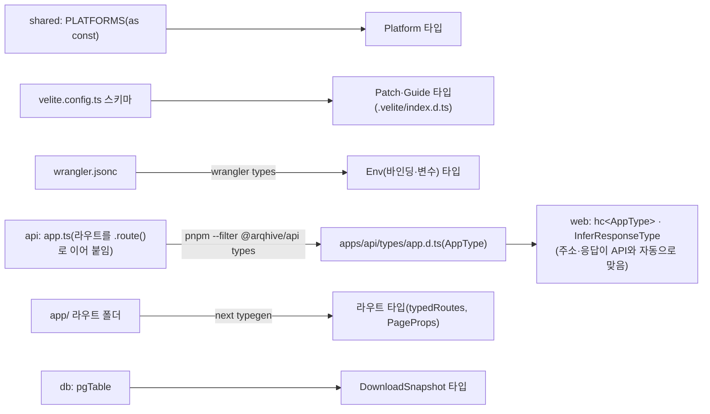

- 도구가 만드는 타입 파일(`worker-configuration.d.ts`, `.next/types`, `apps/api/types`, `.velite/`)은 git에 올리지 않습니다. 검사·빌드 전에 먼저 만듭니다(turbo의 `^types`, CI 단계).
- web이 API 소스(.ts)를 직접 가져오면 Workers 전용 타입을 몰라 오류가 나서, API는 `.d.ts`만 따로 내보냅니다(`exports`의 `types` 조건).

## 9. 콘텐츠가 데이터가 되는 길

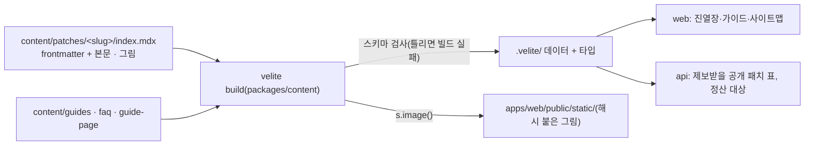

- 패치 정보는 DB가 아니라 파일입니다. 릴리즈 때 저장소 작업과 함께 MDX를 고치고 커밋하면, 배포 때 사이트·사이트맵·API가 함께 바뀝니다.
- 날짜(`latestReleaseDate`)는 한국 날짜로 적습니다.
- 개발 중에는 `pnpm dev:web`이 콘텐츠 감시(`velite dev`)를 같이 띄웁니다.

## 10. 디자인 토큰과 글꼴

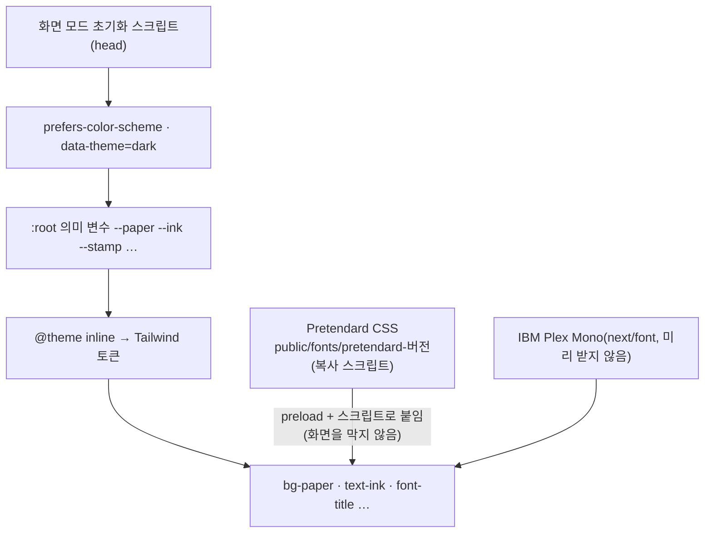

- 화면 모드 우선순위: 사용자가 고른 값 > 시스템 설정 > 밝은 화면.
- 한글 글꼴은 첫 화면을 막지 않습니다. 기기 글꼴로 먼저 뜨고, 글꼴 파일이 오면 Pretendard로 바뀝니다(font-display: swap).
- 16진수 색은 토큰 파일과 재질 CSS에서만 씁니다(Biome `noHexColors`).

## 11. 검사·배포

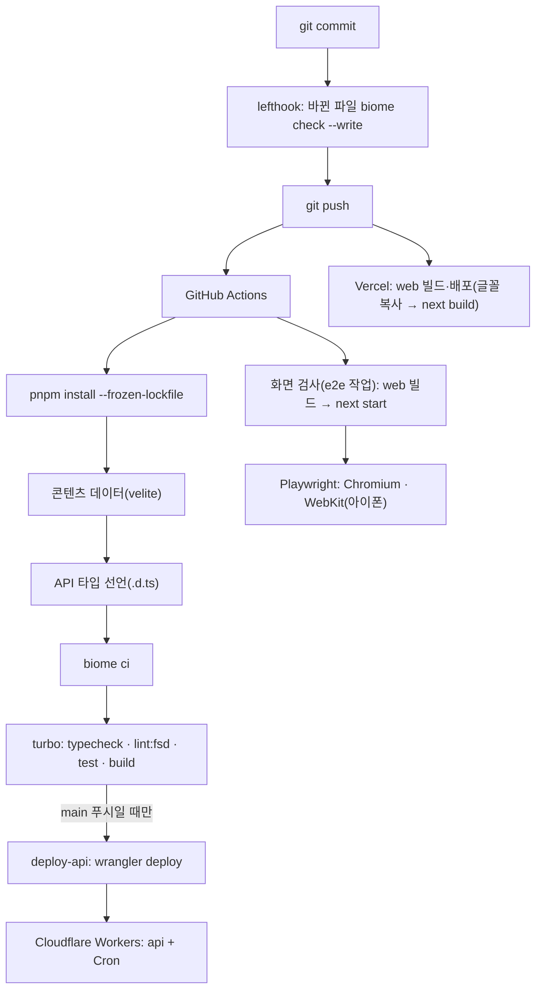

| 검사 | 도구 | 잡는 것 |
|---|---|---|
| 린트·포맷 | Biome(최대한 엄격, ADR 0007) | 스타일, 흔한 실수, 접근성, 보안 패턴, 없는 import |
| 타입 | tsc + next typegen + wrangler types | 타입 오류, 없는 라우트 |
| FSD | Steiger | 층 import 방향, 공개 창구 우회 |
| 테스트 | Vitest | 제보 규칙, 셈법, 알림, 정산 메시지, 한국 날짜 |
| 화면 검사(E2E) | Playwright(Chromium, WebKit 아이폰) | 페이지 오류, 등줄기 글자 겹침·잘림, 케이스 열고 닫기·주소, 소개 띠, 다운로드 링크, 가이드·제보 페이지 |
| 빌드 | next build, wrangler deploy --dry-run | 배포 가능한 결과물 |

- 비밀값은 저장소에 없습니다. 개발은 `apps/api/.dev.vars`·`apps/web/.env.local`·`packages/db/.env`(git 제외), 배포는 `wrangler secret put`과 Vercel 환경 변수.
- DB 표를 바꾸면 `pnpm --dir packages/db db:generate`로 SQL을 만들고(git에 올림) `db:migrate`로 적용합니다.
- Vercel 빌드는 Turborepo 원격 캐시를 씁니다. 입력이 같으면 빌드하지 않고 결과를 되살리므로, 패키지 폴더 밖을 읽는 작업은 그 경로를 입력에 적어야 합니다. 콘텐츠(`@arqhive/content`)는 저장소 맨 위 `content/`를 입력에 넣어 두어, MDX만 바꾼 커밋도 web을 다시 빌드합니다(`turbo.jsonc`).

## 12. 보안

- **웹**(`apps/web/next.config.ts`): CSP 허용 목록(스크립트: 사이트·Turnstile·GoatCounter / 이미지: 사이트·R2·GoatCounter / 접속: 사이트·API·GoatCounter), `frame-ancestors 'none'`, nosniff, Referrer-Policy, Permissions-Policy. 정적 생성을 지키려고 인라인 스크립트는 허용합니다(사용자 글을 HTML로 넣지 않음).
- **API**: Hono `secureHeaders`, CORS는 사이트 주소만. 제보는 봇 확인·횟수 제한·입력 검사·멘션 무력화·이미지 매직 바이트 검사.
- 이슈를 만드는 GitHub 토큰은 패치 저장소의 Issues 권한만 가집니다.

## 13. 모니터링과 장애 대응

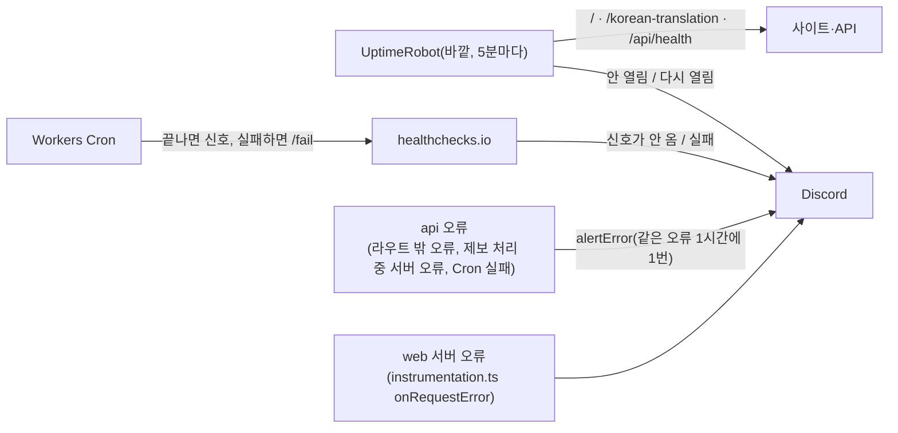

| 겹 | 무엇을 잡나 | 어디서 |
|---|---|---|
| 바깥 감시 | 사이트·API가 통째로 안 열림(Vercel·Cloudflare 장애, 배포 실수) | UptimeRobot(무료) |
| 정기 작업 감시 | Cron이 안 돌았거나 실패(Worker 멈춤 포함) | healthchecks.io(무료), `src/platform/heartbeat.ts` |
| 오류 바로 알림 | 요청 처리 중 예상 못 한 오류 | api `modules/notifications/alert.ts`, web `instrumentation.ts` |

### 알림이 오면

1. **사이트가 안 열림(UptimeRobot)**: [Vercel 대시보드](https://vercel.com/dashboard)의 Deployments에서 마지막 배포가 실패했는지 본다. 실패했으면 이전 배포를 **Promote**(되돌리기). 배포는 정상인데 안 열리면 [Vercel 상태](https://www.vercel-status.com)를 본다.
2. **API가 안 열림(UptimeRobot)**: Cloudflare 대시보드 → Workers → arqhive-api → **Deployments**에서 이전 버전으로 되돌리거나(`wrangler rollback`), [Cloudflare 상태](https://www.cloudflarestatus.com)를 본다.
3. **정기 작업 실패(healthchecks)**: Workers → arqhive-api → **Logs**에서 그 시각의 오류를 본다. 일일 정산은 다음 날 다시 돌면 증가분이 이틀치가 될 뿐이라 급하지 않다. 손으로 다시 돌리려면 개발 서버에서 `/__scheduled?cron=50+14+*+*+*`.
4. **오류 알림(🚨)**: 메시지와 스택 첫 줄로 위치를 찾는다. 웹 오류의 digest는 Vercel → Logs에서 검색한다. GitHub·Neon·GoatCounter 같은 바깥 서비스 오류면 그쪽 상태 페이지부터 본다.
5. **제보가 안 들어옴**: 제보는 이슈로 바로 공개되므로, GitHub 장애 중에는 "보내지 못했습니다"가 뜬다. 복구되면 저절로 돌아온다.

- 비밀값을 바꿨으면(유출 의심 등) 각 서비스에서 새로 만든 뒤 `wrangler secret put 이름` / Vercel 환경 변수를 고치고 다시 배포한다.

### 관리 명령(터미널)

배포는 `main`에 푸시하면 끝납니다. web은 Vercel이, API는 CI가 검사를 통과한 뒤 `wrangler deploy`로 배포합니다(`.github/workflows/ci.yml`의 deploy-api).

| 하고 싶은 일 | 명령(저장소 맨 위에서) |
|---|---|
| **전체 상태 한눈에** | `pnpm ops` (사이트·CI·배포·UptimeRobot·healthchecks·Neon·KV·R2) |
| API 실시간 로그 | `pnpm --dir apps/api exec wrangler tail` |
| API 배포 기록 / 되돌리기 | `pnpm --dir apps/api exec wrangler deployments list` / `… wrangler rollback` |
| API 비밀값 목록 / 넣기 | `… wrangler secret list` / `… wrangler secret put 이름` |
| KV 값 보기 | `… wrangler kv key get notify:pending --binding RATE_LIMIT --remote` |
| CI 기록 / 실패 로그 | `gh run list` / `gh run view --log-failed` |
| 웹 배포 상태 | `gh api repos/arqhive/arqhive-web/commits/main/status` |
| DB 마이그레이션 만들기 / 적용 / 표 보기 | `pnpm --dir packages/db db:generate` / `db:migrate` / `db:studio` |
| 정산 직접 돌려 보기(개발) | `pnpm --dir apps/api dev --test-scheduled` 후 `/__scheduled?cron=50+14+*+*+*` |

`pnpm ops`가 읽는 키는 저장소 맨 위 `.env.ops`(git 제외)에 둡니다: `UPTIMEROBOT_API_KEY`(UptimeRobot의 Read-only API key), `HEALTHCHECKS_API_KEY`(healthchecks 프로젝트 Settings의 read-only key). 둘 다 읽기 전용이라 새도 바꿀 수 있는 것은 없습니다.

## 14. 제보 처리 에이전트

새 제보를 읽고 **처리안**(분류·중복·알려진 문제·첫 답변 초안)을 만들어 운영자에게 보내는 에이전트입니다. 프레임워크 없이 루프를 직접 짰습니다(ADR 0017). GitHub에는 직접 쓰지 않고, 운영자가 승인해야 반영됩니다.

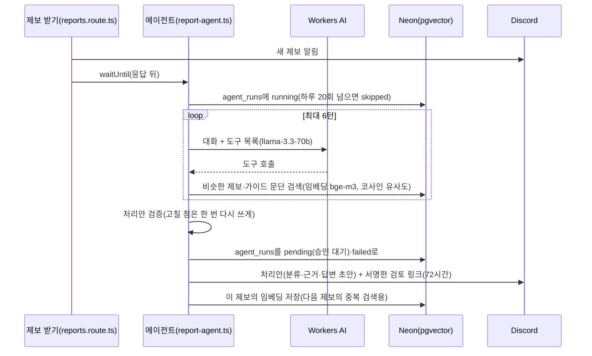

운영자 승인(사람이 눌러야 GitHub에 반영됩니다):

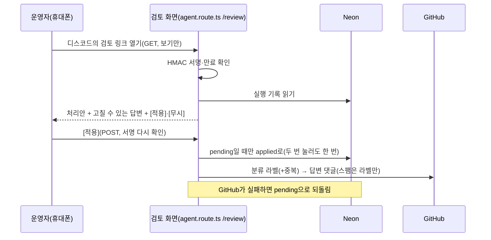

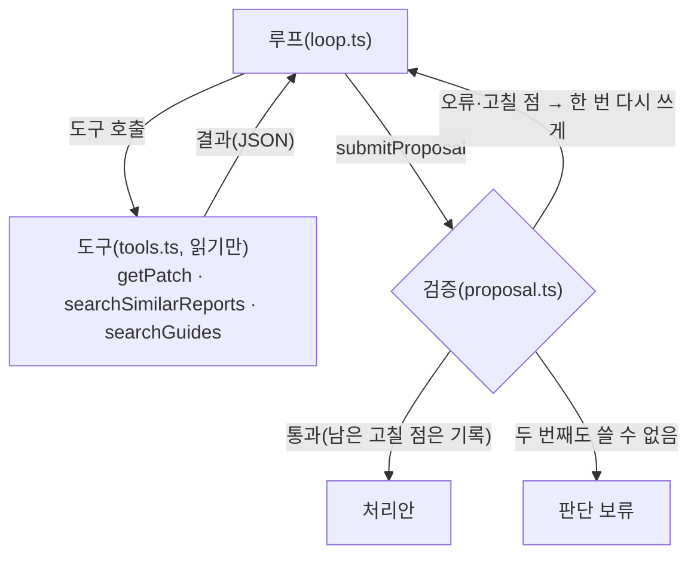

- 제보 본문은 `<report>`로 감싼 데이터로만 다룹니다(그 안의 지시는 따르지 않음, 프롬프트 인젝션 대비).
- 모델은 `ModelFn` 하나로 감싸(`src/platform/workers-ai.ts`) 루프가 모델을 모릅니다. 시험은 정해 둔 답을 내는 가짜 모델로 돌립니다.
- 검증은 모델 출력을 믿지 않습니다.
  - 지어낸 근거(도구 결과에 없는 중복 주소·알려진 문제)는 지웁니다.
  - 합니다체, 옛 버전인데 최신 버전을 안 알림, getPatch를 안 봄, 중복 가능성이 높은 결과(`likelyDuplicate`)를 무시함 → 한 번 다시 쓰게 합니다.
- 표(Neon, `packages/db`): `agent_runs`(실행 기록·상태), `report_embeddings`(제보 임베딩), `guide_chunks`(가이드·FAQ 28문단). 가이드 문단은 일일 정산 Cron이 내용 해시를 비교해 바뀐 것만 다시 임베딩합니다.
- 승인: 링크는 실행 번호·만료 시각을 `AGENT_SIGNING_KEY`로 서명합니다. 링크를 여는 것만으로는 아무것도 바뀌지 않아, 디스코드가 링크를 미리 읽어도 안전합니다. 댓글 끝에는 AI 초안을 운영자가 확인했다는 안내가 붙고, `agent_runs.decision`에 실제로 올린 답변·라벨·초안 수정 여부가 남습니다. 시험 제보는 GitHub에 쓰지 않습니다.
- 한도: Workers AI 무료 한도(하루 1만 뉴런) 때문에 에이전트는 UTC 날짜별 20회까지만 돕니다. `wrangler.jsonc`의 `AGENT_ENABLED`를 `"0"`으로 배포하면 꺼집니다.
- 개발: 시험 제보(REPORT_DRY_RUN)도 에이전트가 돌고 `dry_run`으로 표시됩니다(검색은 같은 쪽끼리만). `POST /api/agent/sync-guides`로 가이드 색인을 바로 맞춥니다(`AGENT_EVAL=1`일 때만).
- 평가: `apps/api/eval/cases.json`(사례 30개, 핵심 15개)을 개발 서버의 `POST /api/agent/eval`(`AGENT_EVAL=1`일 때만 열림)에 보내 채점합니다. `pnpm --dir apps/api agent:eval -- --set core`. 결과는 `eval/results/`에 시각·모델·지시문 버전을 붙여 쌓습니다.
