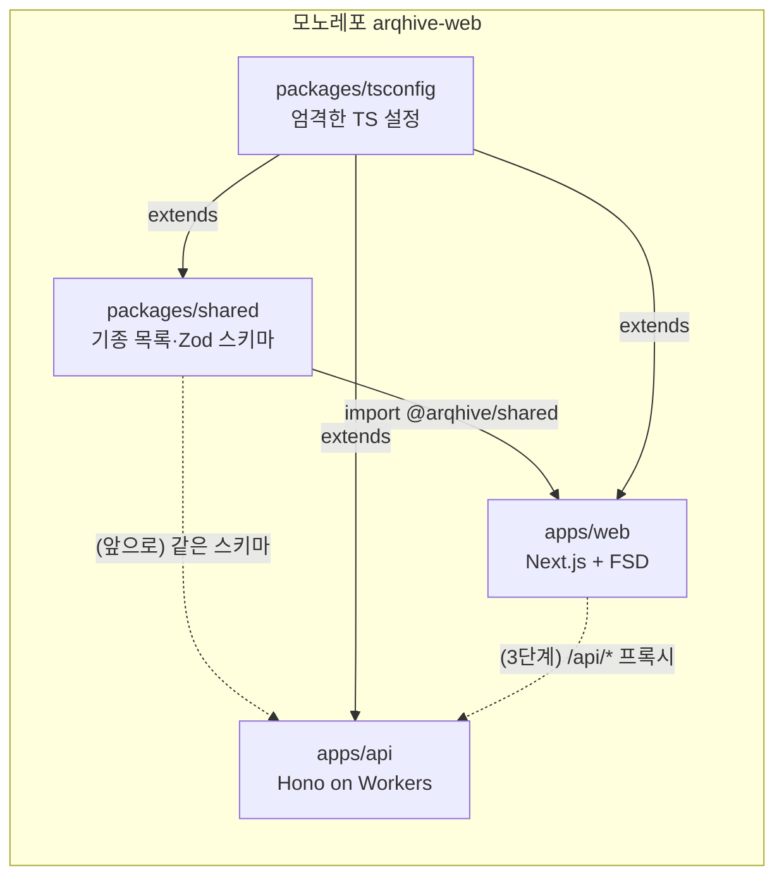
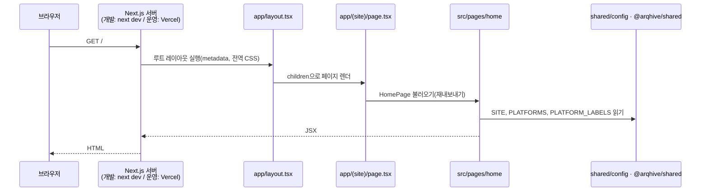
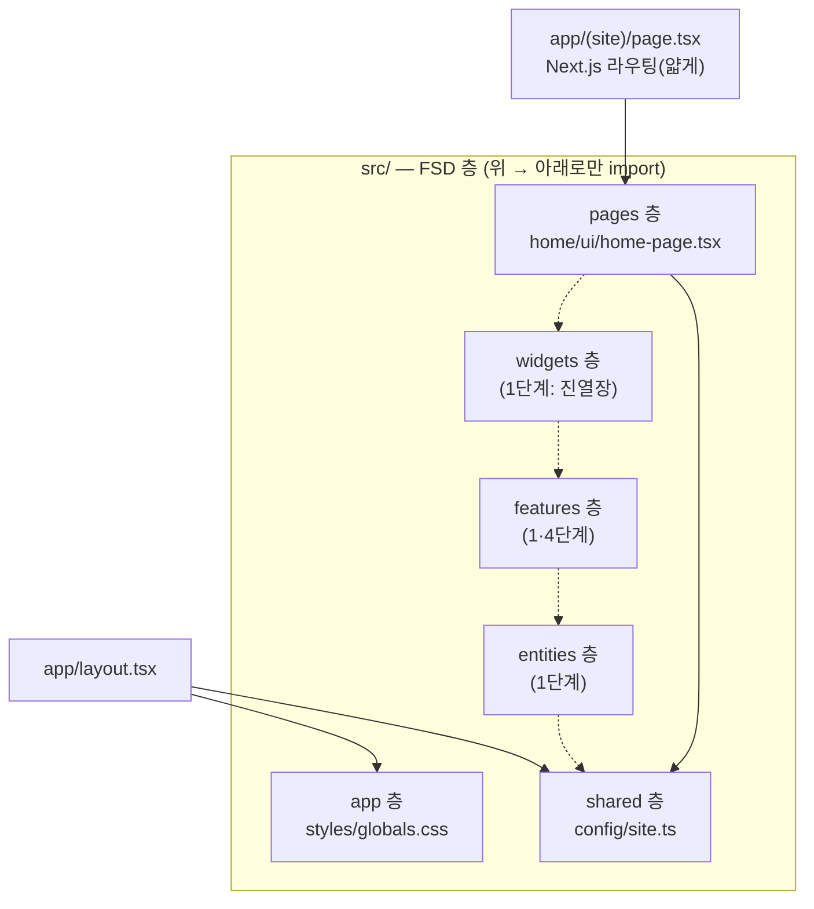
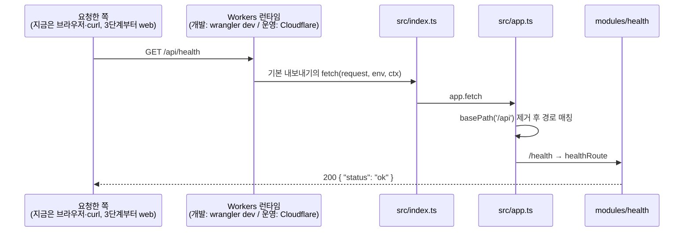
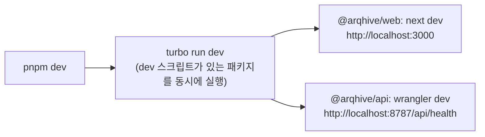
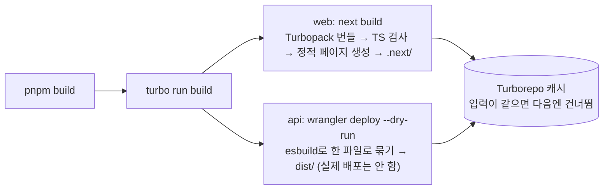
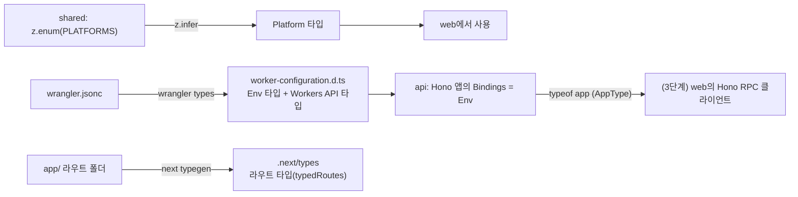
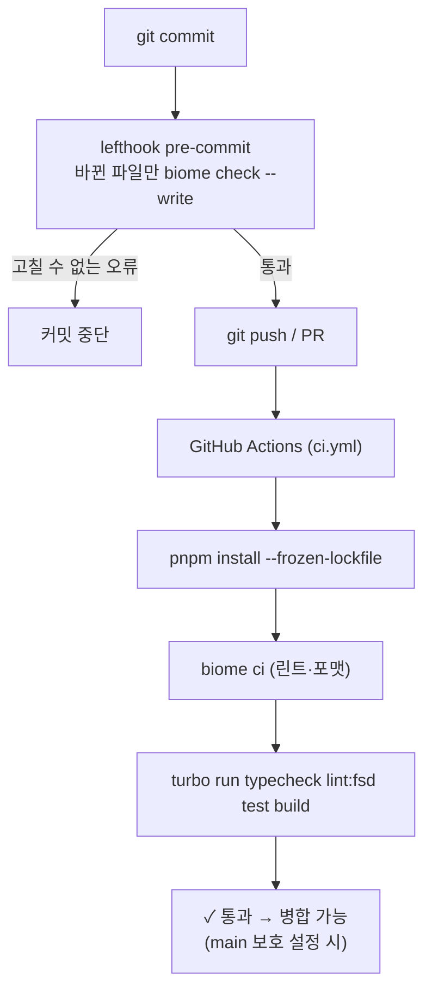
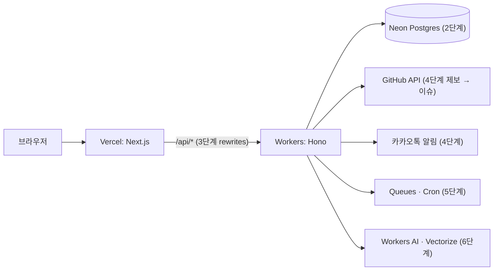

# 앱 흐름 (0단계 기준)

0단계(골격)까지 만들어진 것이 **어떤 순서로 움직이는지** 정리한 문서입니다. 단계가 진행되면 갱신합니다.

> 아직 web과 api는 서로 연결되어 있지 않습니다. 둘을 잇는 `/api/*` 프록시는 3단계에서 붙입니다(마지막 절 참고).

## 1. 전체 그림

- `shared`는 빌드 단계가 없는 **내부 패키지**입니다. TS 원본을 그대로 내보내고, web은 Next.js의 `transpilePackages` 설정으로 함께 컴파일합니다.
- 모든 패키지는 `packages/tsconfig`의 엄격한 설정을 물려받습니다.

## 2. 웹 페이지 요청 흐름 (`GET /`)

- `(site)` 폴더는 **라우트 그룹**이라 주소에 나타나지 않습니다. 그래서 `app/(site)/page.tsx`가 `/` 주소를 맡습니다.
- `page.tsx`는 화면을 직접 그리지 않고, FSD의 `src/pages/home`에서 화면을 가져와 넘기기만 합니다.
- 전부 **서버 컴포넌트**라서 브라우저에는 HTML만 갑니다(이 페이지를 위한 React JS는 내려가지 않음).
- 이 페이지는 데이터 요청이 없어서, 빌드할 때 HTML을 **미리 만들어 둡니다**(빌드 로그의 `○ /  (Static)`). 운영에서는 요청 때마다 렌더하지 않고 만들어 둔 HTML을 바로 줍니다.

### FSD 층에서 본 같은 흐름

점선은 아직 비어 있는 층입니다. 반대 방향(예: shared → pages) import는 Steiger가 오류로 잡습니다.

## 3. API 요청 흐름 (`GET /api/health`)

- Cloudflare는 `src/index.ts`의 **기본 내보내기**에서 `fetch`를 찾아 요청마다 부릅니다. 나중에 `queue`(큐 메시지), `scheduled`(Cron)도 같은 객체에 붙습니다.
- Workers는 서버를 계속 켜 두는 방식이 아닙니다. 요청이 오면 전 세계 Cloudflare 거점에서 가벼운 실행 환경(V8 isolate)을 띄워 처리합니다.

## 4. 개발할 때 (`pnpm dev`)

- 파일을 고치면 web은 화면이 바로 바뀌고(Fast Refresh), api는 Worker가 다시 로드됩니다.
- `shared`를 고치면 web이 그 변경을 바로 반영합니다(빌드 단계가 없으므로).

## 5. 빌드할 때 (`pnpm build`)

## 6. 타입이 만들어지고 흐르는 길

- `worker-configuration.d.ts`, `next-env.d.ts`, `.next/types`는 **도구가 만드는 파일**이라 git에 올리지 않고, 타입 검사 스크립트가 먼저 만들게 했습니다(`typecheck` 스크립트 참고).

## 7. 코드가 검사되는 길 (커밋 → CI)

| 검사 | 도구 | 잡는 것 |
|---|---|---|
| 린트·포맷 | Biome | 코드 스타일, 흔한 실수, 접근성, 보안 패턴 |
| 타입 | tsc (+ next typegen, wrangler types) | 타입 오류, 없는 라우트 링크 |
| FSD 규칙 | Steiger | 층 import 방향, 공개 창구 우회 |
| 테스트 | Vitest | shared 스키마, api health |
| 빌드 | next build, wrangler | 실제로 배포 가능한 결과물이 나오는지 |

## 8. 다음 단계에서 이어질 부분

