# 앱 흐름 (1단계 진행 중 기준)

지금까지 만들어진 것이 **어떤 순서로 움직이는지** 정리한 문서입니다. 커밋마다 흐름이 바뀌면 갱신합니다.

| 갱신 | 바뀐 흐름 |
|---|---|
| 0단계 | 골격: web·api·shared, 검사·CI |
| 1단계 (콘텐츠·토큰) | 콘텐츠 파이프라인(MDX → Velite), 디자인 토큰(@theme, 글꼴, 화면 모드) — 8·9절 |
| 1단계 (케이스 열기 시제품) | 서버 → 클라이언트 데이터 전달, 케이스 열기 연출 — 10절 |
| 1단계 (홈 진열장) | 공통 레이아웃(헤더·푸터), 화면 모드 저장·초기화, 진열장 화면 구성 — 11절. 시제품 페이지 `/lab/case`는 삭제 |

> 아직 web과 api는 서로 연결되어 있지 않습니다. 둘을 잇는 `/api/*` 프록시는 3단계에서 붙입니다(마지막 절 참고).

## 1. 전체 그림

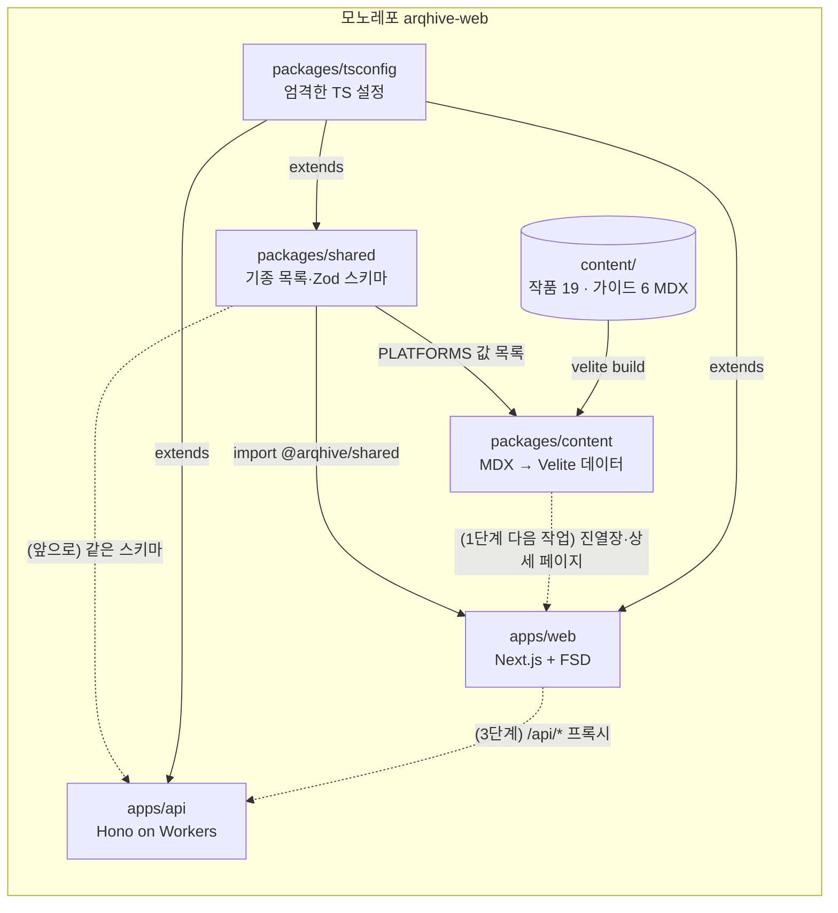

- `shared`는 빌드 단계가 없는 **내부 패키지**입니다. TS 원본을 그대로 내보내고, web은 Next.js의 `transpilePackages` 설정으로 함께 컴파일합니다.
- 모든 패키지는 `packages/tsconfig`의 엄격한 설정을 물려받습니다.

## 2. 웹 페이지 요청 흐름 (`GET /`)

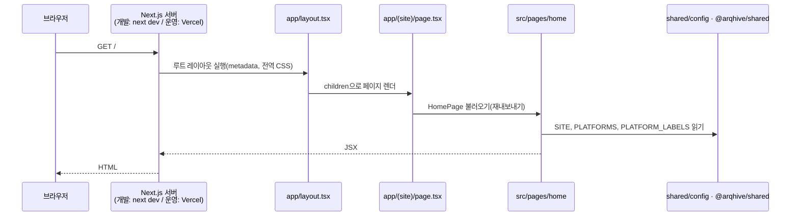

- `(site)` 폴더는 **라우트 그룹**이라 주소에 나타나지 않습니다. 그래서 `app/(site)/page.tsx`가 `/` 주소를 맡습니다.
- `page.tsx`는 화면을 직접 그리지 않고, FSD의 `src/pages/home`에서 화면을 가져와 넘기기만 합니다.
- 전부 **서버 컴포넌트**라서 브라우저에는 HTML만 갑니다(이 페이지를 위한 React JS는 내려가지 않음).
- 이 페이지는 데이터 요청이 없어서, 빌드할 때 HTML을 **미리 만들어 둡니다**(빌드 로그의 `○ /  (Static)`). 운영에서는 요청 때마다 렌더하지 않고 만들어 둔 HTML을 바로 줍니다.

### FSD 층에서 본 같은 흐름

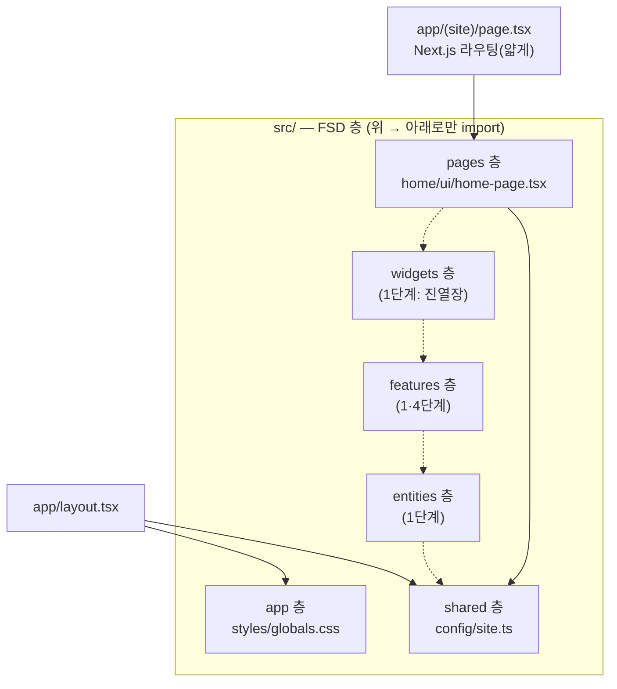

점선은 아직 비어 있는 층입니다. 반대 방향(예: shared → pages) import는 Steiger가 오류로 잡습니다.

## 3. API 요청 흐름 (`GET /api/health`)

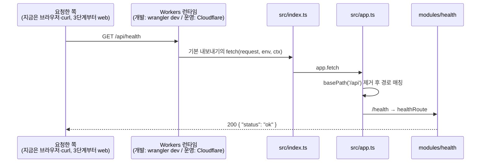

- Cloudflare는 `src/index.ts`의 **기본 내보내기**에서 `fetch`를 찾아 요청마다 부릅니다. 나중에 `queue`(큐 메시지), `scheduled`(Cron)도 같은 객체에 붙습니다.
- Workers는 서버를 계속 켜 두는 방식이 아닙니다. 요청이 오면 전 세계 Cloudflare 거점에서 가벼운 실행 환경(V8 isolate)을 띄워 처리합니다.

## 4. 개발할 때 (`pnpm dev`)

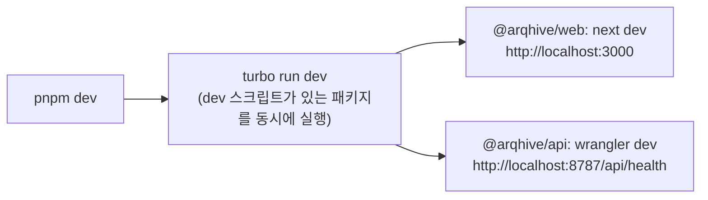

- 파일을 고치면 web은 화면이 바로 바뀌고(Fast Refresh), api는 Worker가 다시 로드됩니다.
- `shared`를 고치면 web이 그 변경을 바로 반영합니다(빌드 단계가 없으므로).

## 5. 빌드할 때 (`pnpm build`)

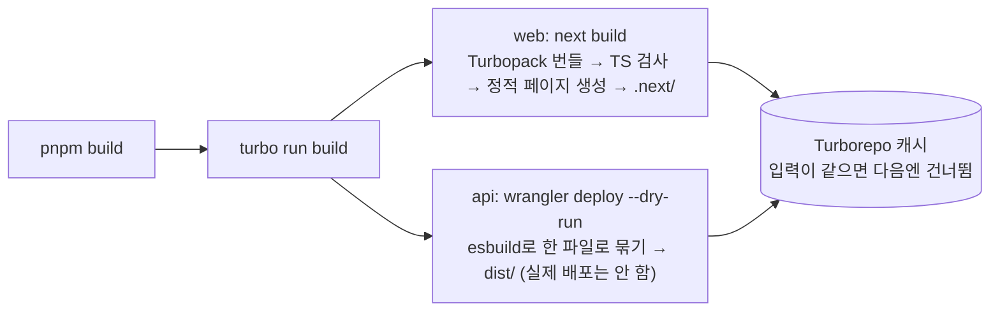

## 6. 타입이 만들어지고 흐르는 길

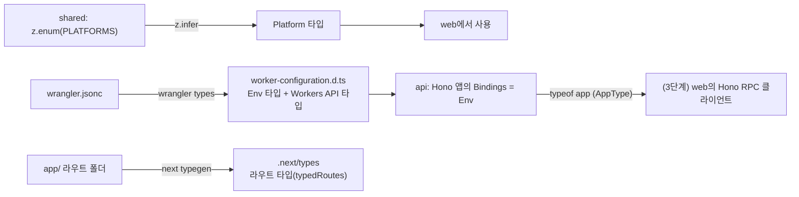

- `worker-configuration.d.ts`, `next-env.d.ts`, `.next/types`는 **도구가 만드는 파일**이라 git에 올리지 않고, 타입 검사 스크립트가 먼저 만들게 했습니다(`typecheck` 스크립트 참고).

## 7. 코드가 검사되는 길 (커밋 → CI)

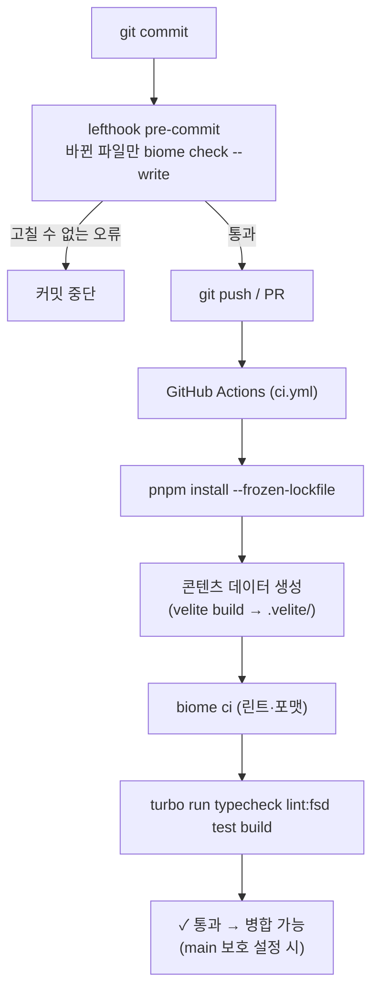

> **왜 Biome보다 Velite가 먼저인가**: Biome은 import한 파일이 실제로 있는지도 검사합니다(`noUnresolvedImports`). `.velite/`는 git에 없는 빌드 결과물이라, 먼저 만들지 않으면 "파일 없음" 오류가 납니다. 로컬에서는 이미 만들어 둔 파일이 있어 통과하고 CI에서만 실패했던 사례가 있습니다(1단계 첫 푸시).

| 검사 | 도구 | 잡는 것 |
|---|---|---|
| 린트·포맷 | Biome | 코드 스타일, 흔한 실수, 접근성, 보안 패턴 |
| 타입 | tsc (+ next typegen, wrangler types) | 타입 오류, 없는 라우트 링크 |
| FSD 규칙 | Steiger | 층 import 방향, 공개 창구 우회 |
| 테스트 | Vitest | shared 스키마, api health |
| 빌드 | next build, wrangler | 실제로 배포 가능한 결과물이 나오는지 |

## 8. 콘텐츠가 데이터가 되는 길 (MDX → Velite)

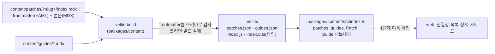

- **작품 하나 = 폴더 하나**(`content/patches/<slug>/index.mdx`). 나중에 스크린샷 원본도 같은 폴더에 둡니다.
- frontmatter의 각 항목(`platform`, `status`, `patchMethod` 등)은 `packages/content/velite.config.ts`의 스키마로 검사됩니다. 예를 들어 `platform: "ps2"`라고 쓰면 빌드가 실패합니다.
- 본문(MDX)은 Velite가 미리 **함수 코드 문자열**로 컴파일해 둡니다. web은 그 문자열을 React 컴포넌트로 바꿔 그립니다(다음 작업).
- `.velite/`는 빌드 결과물이라 git에 올리지 않습니다. `content`의 `typecheck`·`build` 스크립트가 먼저 `velite build`를 실행합니다.
- `patchMethod`는 가이드 slug를 가리킵니다. 작품 페이지의 "적용하기"가 해당 가이드로 연결되는 근거입니다.

## 9. 디자인 토큰이 화면에 닿는 길

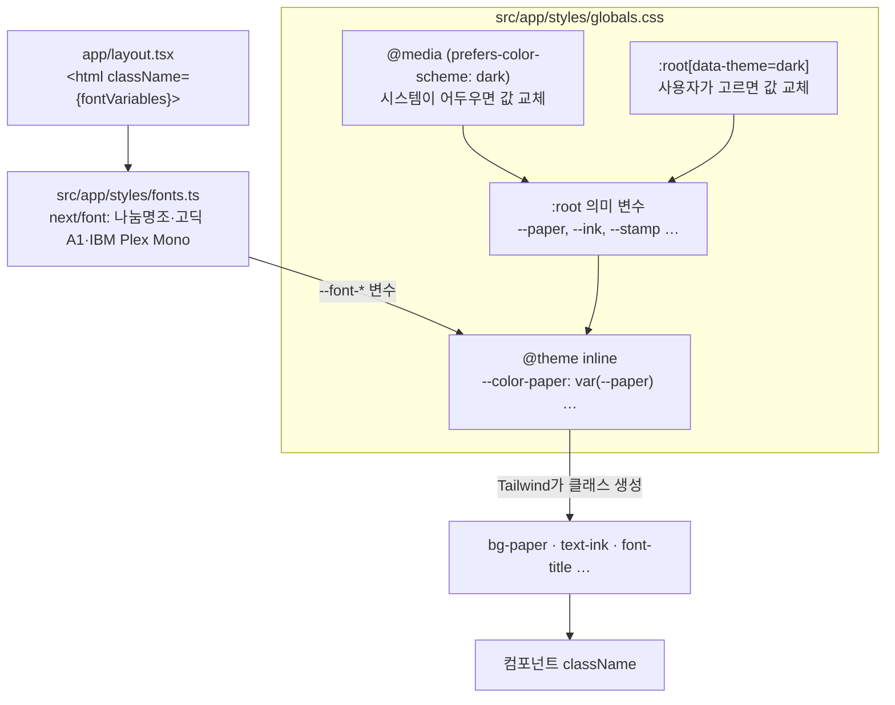

- **토큰은 두 겹**입니다. 아래 겹은 의미 변수(`--paper`), 위 겹은 Tailwind 토큰(`--color-paper`)입니다. 화면 모드가 바뀌면 아래 겹의 값만 바뀌고, 컴포넌트 코드는 그대로입니다.
- `@theme inline`은 "값이 아니라 변수 참조를 그대로 넣어라"는 뜻입니다. 그래서 모드 전환이 즉시 반영됩니다.
- **화면 모드 우선순위**: 사용자가 고른 값(`data-theme`) > 시스템 설정(`prefers-color-scheme`) > 밝은 화면(기본)
- **글꼴**: `next/font`가 빌드할 때 Google Fonts에서 파일을 받아 사이트에 함께 올립니다. 방문자는 Google 서버에 요청하지 않습니다. 한글 글꼴은 글자 범위별로 나뉜 파일 중 필요한 것만 받습니다.
- 16진수 색은 `globals.css`에서만 쓸 수 있습니다(Biome `noHexColors`). 다른 파일은 토큰을 써야 합니다.

## 10. 케이스 열기 (지금은 홈 진열장에서 사용)

### 데이터가 화면까지

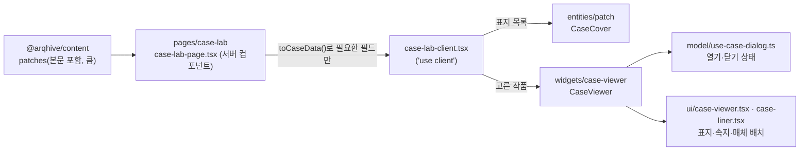

- **서버 → 클라이언트 경계에서 데이터 줄이기**: 서버 컴포넌트는 콘텐츠 전체를 읽지만, 클라이언트 컴포넌트에 넘기는 값은 브라우저로 전송됩니다. 그래서 `toCaseData()`로 케이스에 필요한 10개 필드만 골라 넘깁니다(MDX 본문 제외).
- **FSD 층 나누기**: 작품이 "어떻게 생겼나"(표지·디스크·팩)는 `entities/patch`, "어떻게 열리나"(연출·상태)는 `widgets/case-viewer`, 화면 조립은 `pages/case-lab`이 맡습니다. 위젯 안에서도 상태 로직은 `model/`, 화면은 `ui/` 칸으로 나눴습니다.

### 열고 닫는 순서

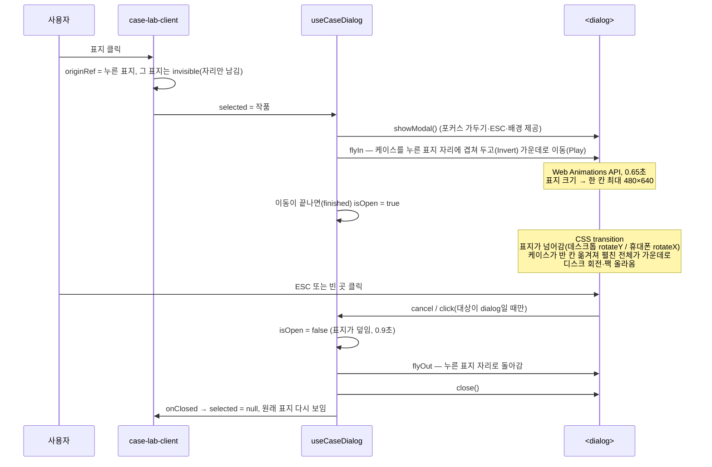

- **"동작 줄이기"** 설정을 켠 사용자는 transition 없이 바로 열고 닫습니다(`motion-reduce:`).
- **반응형**: md(768px) 이상은 가로로 펼침(왼쪽 속지·오른쪽 케이스), 그보다 좁으면 세로로 펼침(위 속지·아래 케이스)입니다.
- **크기**: 데스크톱은 케이스 한 칸 최대 480×640(펼치면 960×640), 화면이 작으면 높이 86%·폭 61% 안에 맞춰 줄어듭니다. 휴대폰은 펼친 전체가 화면 높이 88% 안에 들어가게 맞춥니다.
- **기종별 크기**: 실물 치수(mm)를 Wii 킵 케이스(190×135) 대비 비율로 맞춥니다(`case-spec.ts`의 `scale`·`aspect`·`faceHeight`·`viewerHeight`, 선반은 `SPINE_SIZES`). GC는 0.763배, 3DS·NDS는 0.611배이고 가로가 조금 긴 정사각형에 가깝습니다. 작은 케이스는 속지에서 줄거리를 빼고 글자를 줄입니다(`CaseLiner`의 compact).
- **FLIP**: First(처음 위치) → Last(끝 위치) → Invert(끝 위치의 요소를 처음 위치로 보이게 transform) → Play(transform을 없애며 이동). 위치를 바꾸는 대신 transform만 움직여서 부드럽습니다.

### GC·SFC·GB·GBA: 종이상자에서 꺼내 여는 단계

GC 소프트는 검은 킵 케이스가 종이상자에 한 번 더 들어 있습니다. 그래서 열기·닫기를 **단계(phase)** 로 나눴습니다.

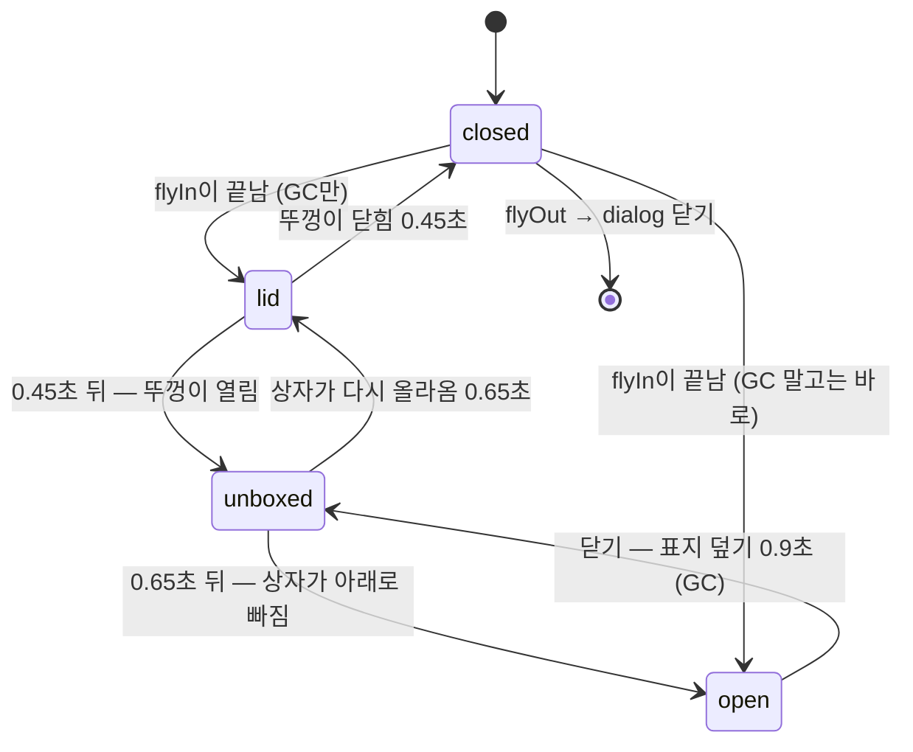

- **순서는 데이터로**: `widgets/case-viewer/lib/phases.ts`의 `openSteps`·`closeSteps`가 "어느 단계로 바꾸고 몇 ms 기다릴지" 목록을 돌려주고, `runSteps`가 차례로 밟습니다. 훅(`model/use-case-dialog.ts`)은 순서를 몰라도 됩니다.
- **취소**: 열기 도중 닫으면 앞 순서가 남은 단계를 계속 밟으면 안 됩니다. 순서마다 번호(`runRef`)를 받고, 번호가 바뀌면 멈춥니다.
- **화면은 단계만 읽음**: 상자 `CaseOuterBox`는 `lidOpen = phase !== 'closed'`, `unboxed = phase가 unboxed·open`을 받아 CSS transition으로 움직입니다. 표지가 넘어가는 조건은 `phase === 'open'`입니다.
- **카트리지 상자(SFC·GB·GBA, form `carton`)**: 같은 단계를 밟습니다. 상자가 빠지면 설명서(`ManualFront`)와 그 아래 카트리지(`Cartridge`)가 드러나고, 설명서가 펼쳐지면 안쪽 면(`ManualInner`)에 패치 정보가 보입니다. 상자가 있는지는 `hasOuterBox(spec)` 하나로 판단합니다.
- **앞면**: 넘어가는 앞면은 `CaseFront`입니다. GC는 표지가 상자에 인쇄되어 있으므로 게임 이름만 쓴 검은 케이스 앞면이고, 진열장의 표지(`CaseCover`)는 상자 앞면입니다. 선반 등줄기도 상자 옆면이라 흰 종이에 윗부분만 검은 기종 띠(`paper-band`)이고, 윗뚜껑은 상자 앞면과 같은 기종 색(`caseClass`)에 판지 테두리(`paper-lid`)만 더합니다.

## 11. 홈 진열장 (`/`)

### 화면이 조립되는 길

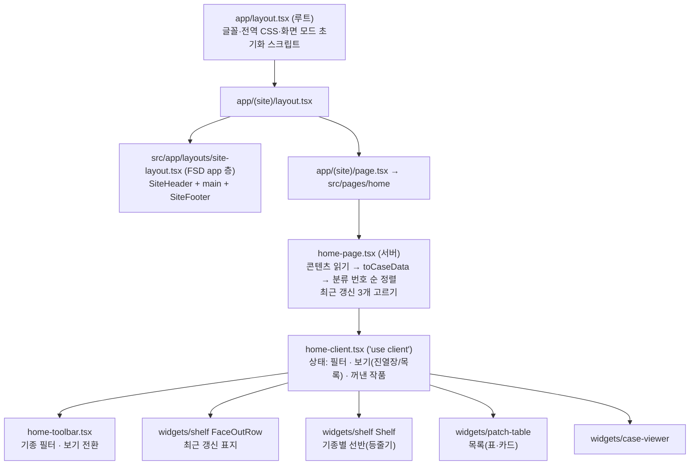

- **왜 헤더·푸터가 app 층인가**: 모든 공개 페이지에 공통이라 화면(pages)이 아니라 앱 전체 틀(app 층)의 일입니다. Next.js의 `app/(site)/layout.tsx`는 FSD의 `SiteLayout`을 불러오기만 합니다.
- **필터·보기 전환을 features로 빼지 않은 이유**: 지금은 홈에서만 씁니다. FSD도 "여러 곳에서 쓰이기 전까지는 쓰는 곳 가까이"를 권합니다.
- **누른 요소 감추기**: 같은 작품이 "최근 갱신"과 선반에 동시에 있을 수 있어서, 작품이 아니라 **실제로 누른 요소**(`element.style.visibility`)를 감추고 닫힐 때 되돌립니다.

### 화면 모드(밝게·어둡게)

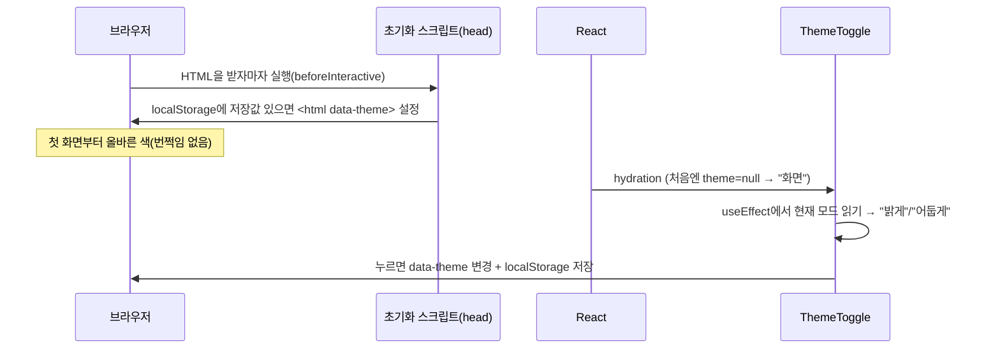

- 저장값이 없으면 시스템 설정(`prefers-color-scheme`)을 따릅니다(globals.css의 미디어 쿼리).
- 버튼 글자를 처음에 `null`("화면")로 두는 이유: 서버는 사용자의 모드를 모르므로, 서버 HTML과 브라우저 첫 렌더를 같게 해야 hydration 오류가 나지 않습니다.

## 12. 다음 단계에서 이어질 부분

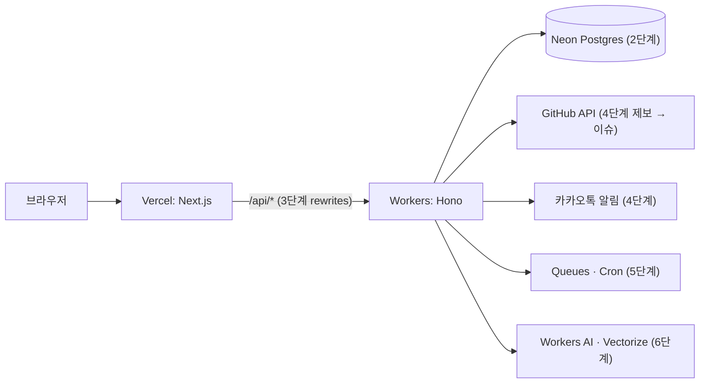
